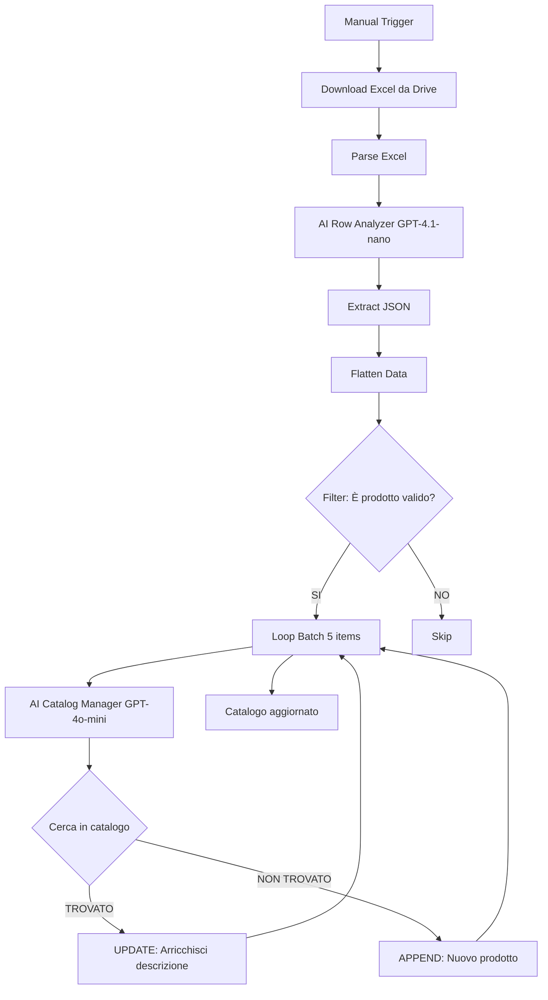

# 📙 n8n Workflow - Catalogo Smart per Impianti Elettrici

## 🎯 Panoramica

Sistema automatizzato per creare e mantenere un catalogo prodotti di impianti elettrici a partire da preventivi Excel, usando AI per:
- Filtrare prodotti da servizi/opere
- Normalizzare descrizioni variabili
- Evitare duplicati con semantic matching
- Arricchire dati esistenti

---

## 📦 File Forniti

```
/home/user/n8n/
├── workflow_catalogo_improved.json       # Versione BASE (Excel semplici)
├── workflow_catalogo_advanced.json       # Versione ADVANCED (con 1 Code node - ⚠️ errore "trim")
├── workflow_catalogo_ai_consolidator.json # ⭐ Versione FULL AI (CONSIGLIATA - zero Code nodes)
├── code_node_fixed.js                    # Fix per errore ADVANCED
├── WORKFLOW_GUIDE.md                     # 📘 Guida versione BASE
├── ADVANCED_VERSION_GUIDE.md             # 📗 Guida versione ADVANCED
├── FULL_AI_VERSION_GUIDE.md              # 🎯 Guida versione FULL AI (dettagliata)
├── QUALE_VERSIONE_SCEGLIERE.md           # 🤔 Guida scelta versione
├── workflow_analysis.md                  # 🔍 Analisi problemi workflow originale
└── README_WORKFLOW_CATALOGO.md           # 📄 Questo file
```

---

## 🚀 Quick Start

### ⚡ Scelta Rapida Versione

- **Excel con righe multiple / Hai errore "trim not function"** → Usa **FULL AI** ⭐
- **Excel semplice (1 riga = 1 prodotto)** → Usa **BASE**
- **Leggi guida completa** → Vedi `QUALE_VERSIONE_SCEGLIERE.md`

### 1. Importa Workflow in n8n

**Opzione A: Versione FULL AI** ⭐ **CONSIGLIATA per la maggior parte dei casi**
```bash
1. Apri n8n
2. Click "+" → "Import from file"
3. Seleziona: workflow_catalogo_ai_consolidator.json
4. Conferma import
```
✅ Zero Code nodes | ✅ Gestisce righe multiple | ✅ Mai errori "trim"

**Opzione B: Versione BASE (Excel semplici)**
```bash
1. Apri n8n
2. Click "+" → "Import from file"
3. Seleziona: workflow_catalogo_improved.json
4. Conferma import
```
✅ Veloce | ✅ Economico | ❌ No righe multiple

**Opzione C: Versione ADVANCED (solo se serve velocità massima)**
```bash
1. Apri n8n
2. Click "+" → "Import from file"
3. Seleziona: workflow_catalogo_advanced.json
4. ⚠️ Se hai errore "trim": usa fix in code_node_fixed.js
```
⚡ Velocissimo | ⚠️ 1 Code node (possibili errori)

### 2. Configura Credenziali

Configura le seguenti credenziali in n8n:

#### Google Drive OAuth2
- Usata da: nodo "Download Excel"
- Scope richiesti: `https://www.googleapis.com/auth/drive.readonly`
- Setup: Settings → Credentials → Add credential → Google Drive OAuth2

#### Google Sheets OAuth2
- Usata da: nodi Tools (READ, UPDATE, APPEND)
- Scope richiesti: `https://www.googleapis.com/auth/spreadsheets`
- Setup: Settings → Credentials → Add credential → Google Sheets OAuth2

#### OpenAI API
- Usata da: AI Agents
- Modelli richiesti: `gpt-4.1-nano`, `gpt-4o-mini`
- Setup: Settings → Credentials → Add credential → OpenAI
- Inserisci API key da https://platform.openai.com/api-keys

### 3. Aggiorna ID Files

Nel workflow, aggiorna questi parametri:

**Nodo "Download Excel":**
```
fileId: [TUO_FILE_ID_GOOGLE_DRIVE]
```

Come trovare File ID:
1. Apri file in Google Drive
2. URL sarà: `https://drive.google.com/file/d/12xobrtNcwYLrUZ-xUUnmxYqUZUVqptRw/view`
3. File ID è la parte centrale: `12xobrtNcwYLrUZ-xUUnmxYqUZUVqptRw`

**Nodi "Catalogo READ/UPDATE/APPEND":**
```
documentId: [TUO_SHEET_ID]
sheetName: [NOME_FOGLIO]
```

Come trovare Sheet ID:
1. Apri Google Sheet
2. URL sarà: `https://docs.google.com/spreadsheets/d/1Rg0oVT04mG4oy2OhgiYDNZVhSCLTyBFgVKdODIyQIEM/edit`
3. Sheet ID è la parte centrale: `1Rg0oVT04mG4oy2OhgiYDNZVhSCLTyBFgVKdODIyQIEM`

### 4. Prepara Excel Preventivo

Il file Excel deve avere queste colonne (minimo):

```
| MACRO | DESCRIZIONE | U.M. | Q.TA' | COSTO UNITAR. MATERIALE | Tempo pos min/copp |
```

**Note:**
- Header deve essere in riga 1
- Colonne possono avere nomi con spazi/caratteri speciali (come nel tuo file originale)
- Il workflow gestirà automaticamente variazioni

### 5. Prepara Google Sheet Catalogo

Crea un Google Sheet con queste colonne:

```
| id_prodotto | description | category | unita_misura | costo_materiale_unitario | minuti_manodopera_unitari | Tempo pos min/copp |
```

**Esempio prima riga (header):**
```
id_prodotto | description | category | unita_misura | costo_materiale_unitario | minuti_manodopera_unitari | Tempo pos min/copp
```

### 6. Esegui Workflow

1. Apri workflow in n8n
2. Click su "Execute Workflow" (Manual Trigger)
3. Monitora esecuzione nei log
4. Verifica risultati in Google Sheet catalogo

---

## 📊 Cosa Fa il Workflow

### Flusso Completo (Versione BASE)



### Per Ogni Riga Excel

**1. Classificazione (AI Row Analyzer)**
- Determina se: prodotto / servizio / categoria
- Skip: trasporti, demolizioni, opere, intestazioni
- Normalizza descrizioni e estrae dati tecnici

**2. Filtro**
- Tiene solo prodotti validi (`keep = true`)
- Verifica presenza descrizione

**3. Integrazione Catalogo (AI Catalog Manager)**
- **Semantic matching**: Cerca prodotti simili (>75% similarità)
- **Se trovato**: Aggiorna prezzo/minuti, arricchisce descrizione
- **Se nuovo**: Genera ID e inserisce in catalogo

---

## 🆚 Quale Versione Scegliere?

### Scegli VERSIONE BASE se:
- ✅ Preventivi hanno struttura consistente (1 riga = 1 prodotto completo)
- ✅ Vuoi semplicità massima (solo AI Agents + Set nodes)
- ✅ Preferisci evitare Code nodes
- ✅ Puoi normalizzare Excel manualmente se necessario

### Scegli VERSIONE ADVANCED se:
- ✅ **Prezzi spesso su righe separate dalla descrizione** ⭐ (tuo caso)
- ✅ Preventivi hanno formattazione variabile/complessa
- ✅ Categorie sparse nel documento
- ✅ Accetti 1 Code node per consolidamento righe

**💡 Raccomandazione per il tuo caso:** Inizia con **ADVANCED** dato che hai il problema delle righe multiple.

---

## 💰 Costi Stimati

### Versione BASE

Per 1000 righe Excel:
- AI Row Analyzer (GPT-4.1-nano): ~$0.15
- AI Catalog Manager (GPT-4o-mini, dopo filtro ~30%): ~$0.50
- **Totale: ~$0.65 per 1000 righe**

### Versione ADVANCED

Per 1000 righe Excel (consolidate a ~800):
- AI Row Analyzer (GPT-4.1-nano): ~$0.12
- AI Catalog Manager (GPT-4o-mini): ~$0.40
- **Totale: ~$0.52 per 1000 righe**

(Advanced è più economico perché processa meno righe grazie a consolidamento)

---

## 🔧 Personalizzazioni Comuni

### Cambiare Threshold Semantic Matching

Nel prompt di "AI Catalog Manager", cambia questa riga:

```
Da: Match se: similarità descrizione > 75%
A:  Match se: similarità descrizione > 85%
```

(85% = matching più rigido, meno false positive)

### Cambiare Batch Size

Nel nodo "Loop Batch":

```
Da: batchSize: 5
A:  batchSize: 10
```

(Batch più grandi = più veloce ma più API calls simultanee)

### Aggiungere Categorie Custom

Nel prompt "AI Row Analyzer", aggiungi esempi:

```
Esempi servizi da SKIPPARE:
- TRASPORTO
- DEMOLIZIONE
- [TUA CATEGORIA CUSTOM]
```

### Cambiare Modelli AI

**Se vuoi più accuratezza:**
```
AI Catalog Manager: gpt-4o (invece di gpt-4o-mini)
```

**Se vuoi massimo risparmio:**
```
AI Row Analyzer: gpt-4.1-nano (già ottimale)
AI Catalog Manager: gpt-4.1-nano (test prima!)
```

---

## 🐛 Troubleshooting

### Errore: "JSON parse error"

**Causa:** AI restituisce markdown code blocks
**Fix:** Già gestito in "Extract JSON", ma se persiste aggiungi nel prompt:
```
IMPORTANTE: Rispondi SOLO con JSON puro senza ```json wrapper
```

### Errore: "Duplicate products"

**Causa:** Threshold matching troppo basso
**Fix:** Aumenta threshold da 75% a 85% nel prompt AI Catalog Manager

### Errore: "Missing credentials"

**Causa:** Credenziali non configurate
**Fix:**
1. Settings → Credentials
2. Aggiungi Google Drive, Google Sheets, OpenAI
3. Riconnetti nei nodi workflow

### Problema: "Categorie importate come prodotti"

**Causa:** AI non riconosce intestazioni
**Fix:** Nel prompt AI Row Analyzer, aggiungi esempi categorie:
```
Esempi categorie da SKIP:
- IMPIANTO ELETTRICO
- QUADRI
- ILLUMINAZIONE
```

### Problema: "Prezzi mancanti (null)"

**Causa:** Prezzo su riga separata
**Fix:** Usa VERSIONE ADVANCED invece di BASE

---

## 📖 Documentazione Completa

- **WORKFLOW_GUIDE.md**: Guida dettagliata versione base
  - Architettura completa
  - Configurazione nodi
  - Mapping campi
  - Testing e validation

- **ADVANCED_VERSION_GUIDE.md**: Guida versione advanced
  - Logica consolidamento righe
  - Code node spiegato
  - Esempi merge
  - Performance comparison

- **workflow_analysis.md**: Analisi problemi workflow originale
  - Problemi identificati
  - Soluzioni implementate

---

## 🎓 Best Practices

### 1. Testa con Sample Piccolo
```
1. Prepara Excel con 20-30 righe miste (categorie, servizi, prodotti)
2. Esegui workflow
3. Valida risultati manualmente
4. Ajusta prompts se necessario
5. Scale up a preventivi completi
```

### 2. Backup Prima di Eseguire
```
1. Crea copia Google Sheet catalogo
2. Esegui workflow sulla copia
3. Valida risultati
4. Se OK, usa su catalogo principale
```

### 3. Monitoring
```
1. Controlla log esecuzione per errori
2. Verifica output intermedio di ogni nodo
3. Conta prodotti created vs updated
4. Valida nessun duplicato in catalogo
```

### 4. Iterazione
```
1. Analizza pattern errori nei log
2. Ajusta prompts AI
3. Re-run solo righe fallite
4. Refine threshold matching
```

---

## 🔄 Workflow Esistente vs Nuovo

### Problemi Risolti

| Problema Originale | Soluzione Implementata |
|-------------------|------------------------|
| Nodo "Trasforma output AI" vuoto | Sostituito con Extract JSON + Flatten Data funzionanti |
| Importa servizi/opere | Prompt AI Row Analyzer filtra solo prodotti |
| Confonde categorie con prodotti | Logica di classificazione categoria/prodotto migliorata |
| Prezzi su righe diverse | Versione ADVANCED con Code node consolidamento |
| Code nodes non funzionanti | Eliminati (BASE) o ridotti a 1 solo essenziale (ADVANCED) |
| Modelli AI non ottimizzati | Dual-model: nano per validazione, mini per catalogo |

### Miglioramenti Architetturali

- ✅ Prompts più chiari e strutturati
- ✅ Output JSON garantito con fallback
- ✅ Filter robusto pre-catalogazione
- ✅ Batch size ridotto (5 vs 10) per stability
- ✅ Semantic matching con threshold configurabile
- ✅ Descrizioni arricchite invece che sovrascritte

---

## 📞 Supporto & Contributi

### Se Incontri Problemi

1. **Verifica log esecuzione** in n8n (mostra errori dettagliati)
2. **Testa singoli nodi** in isolation (Execute Node)
3. **Valida formato input** (Excel e Google Sheet)
4. **Controlla credenziali** (tutte configurate e valide)
5. **Consulta documentazione** (WORKFLOW_GUIDE.md)

### Miglioramenti Futuri Possibili

- [ ] Logging strutturato (Google Sheet separato per audit)
- [ ] Notifiche Slack/Telegram per errori
- [ ] Import incrementale (solo nuove righe)
- [ ] Validazione pre-import (check formato Excel)
- [ ] Dashboard riepilogativa (created/updated/skipped)
- [ ] Export catalogo in formati multipli (CSV, PDF)

---

## 📄 License & Credits

Workflow creato per gestione cataloghi impianti elettrici.
Basato su n8n workflow automation platform.
AI powered by OpenAI GPT models.

---

## 🎉 Getting Started Now

**Per iniziare SUBITO:**

1. ✅ Importa `workflow_catalogo_advanced.json` in n8n
2. ✅ Configura 3 credenziali (Google Drive, Sheets, OpenAI)
3. ✅ Aggiorna File ID e Sheet ID
4. ✅ Esegui con file test 20 righe
5. ✅ Valida risultati
6. ✅ Scale up a preventivi completi

**Tempo setup**: ~15 minuti
**Risultato**: Catalogo automatizzato e sempre aggiornato

Buon lavoro! 🚀
